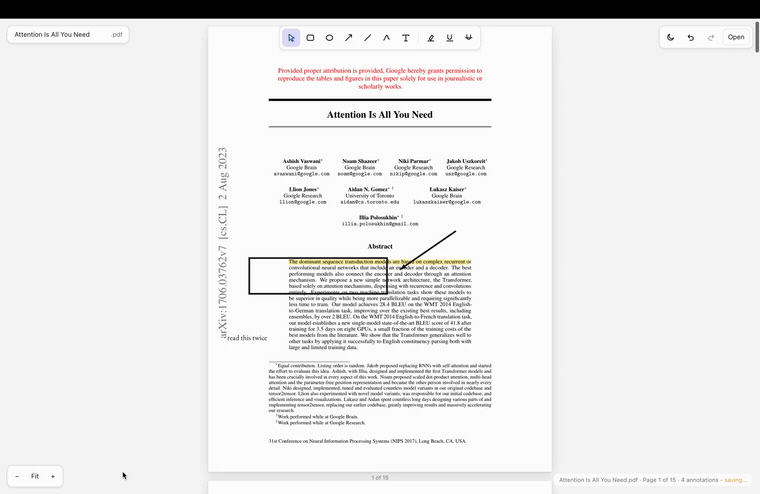

# Marginalia

*Notes in the margins.* Your PDF is the canvas.

An Excalidraw-style annotator for the papers you actually read. It has the
markup tools Preview has — highlight, underline, strike through, shapes,
freehand, text — plus the one it doesn't: **paste an image straight onto the
page, then move, resize and rotate it.**

Everything is written as **real PDF annotation objects**, so a file saved here
opens correctly in Preview, Acrobat or a browser, with the markup still
selectable rather than baked into the page. Reopen a file here and every mark
is still a live object you can drag, retype or delete.



*Highlighting, a box and an arrow, a note in the margin, then a figure lifted
off page 3 and dropped onto page 1.*
**[Watch the full 36-second demo, with sound](demo/video/Marginalia.mp4)**

---

## Requirements

| | |
|---|---|
| **macOS** | Built and tested on macOS 14 (Apple Silicon). The clipboard, packaging and verification steps are macOS-specific. |
| **Node.js 18+** | `node -v`. Electron and the PDF writer run on it. |
| **Python 3 + PyObjC** | Optional, for the test suite only. Lets the tests verify output through PDFKit — the framework Preview is built on. |

## Setup

```bash
git clone https://github.com/Namyalg/marginalia.git
cd marginalia
npm install          # also vendors pdf.js into renderer/
npm start            # run it
```

`npm start` opens an empty window; `npm start -- path/to/file.pdf` opens a
document straight away. You can also drop a PDF on the app icon.

Setting this up on a fresh machine, or handing it to a coding agent to install?
[**to-another-agent.md**](to-another-agent.md) is a short, self-contained walkthrough:
install, run, what to test and in what order, and the one rule about never
pointing a test at a PDF you care about.

### Install it as a Mac app

To get a real `Marginalia.app` on your Desktop and in the Dock:

```bash
npm run icon          # generates build/icon.icns
npm run pack          # builds dist/Marginalia-darwin-<arch>/Marginalia.app
npm run install-app   # copies to ~/Desktop, ad-hoc signs it, pins it to the Dock
```

It is ad-hoc signed and de-quarantined so it opens without a Gatekeeper
prompt. Distributing it to anyone else would need an Apple Developer ID.

### For the tests (optional)

```bash
python3 -m venv .venv
.venv/bin/pip install pyobjc-framework-Quartz
```

Checks that need PyObjC report `skipped` without it. Override the interpreter
with `PDFKIT_PYTHON=/path/to/python`.

---

## Features


| | |
|---|---|
| **Highlight / Underline / Strike Through** | Select text with the cursor, exactly like Preview. Bands are built from the PDF's own text metrics, so they hug the glyphs. |
| **Rectangle, Oval, Line, Arrow** | Drag to draw. Hold ⇧ for a perfect square/circle, or to snap a line to 45°. |
| **Draw** | Freehand ink. |
| **Text** | Pick the tool and a box appears ready to type in — Apple documents Preview's as "Type your text, then drag the text box where you want", and this matches. Click the page to place another. |
| **Paste** | ⌘V drops whatever is on the clipboard onto the current page. An image — a ⌘⇧4 screenshot, a copy from a browser, or an image file copied in Finder — becomes a stamp; text becomes a text box. Inside a text box, ⌘V pastes inline as usual. |
| **Move / resize / rotate** | Drag a pasted image to move it, its corners to resize — **aspect ratio is locked**, hold ⇧ to distort deliberately — and its grip to rotate freely (⇧ snaps to 15°). ⌘[ and ⌘] turn it in quarter steps. Marks cannot be dragged off the page. |
| **Undo / redo** | ⌘Z / ⇧⌘Z, full history, plus buttons in the top-right. |
| **Saves itself** | About a second after you stop working, straight back to the file you opened. There is no Save button. |
| **Editable next time** | Close it, open the same PDF tomorrow, and every mark — including pasted images — is still a live object you can move, retype or delete. |
| **Across pages** | Drag a mark from one page onto another. |
| **Rename in place** | Click the document name, top-left, and type. It renames the file on disk. |
| **Light / dark** | Follows the system until you pick one, then remembers. |

### Keyboard

Tools are chosen from the toolbar, not the keyboard: a bare letter would fire
while you were typing into a text box or renaming the document.

```
⌘Z / ctrl+Z   undo            ⌘V   paste (image or text)
⇧⌘Z           redo            ⌘O   open
⌘S            save now        ⌘0   fit page   ⇧⌘0 fit width   ⌥⌘0 actual size
⌘+ ⌘-         zoom            ⌘[ ⌘]  rotate a pasted image
esc           finish editing / deselect        ⌫  delete the selected mark
```

It saves itself a moment after you stop, so ⌘S is only there if you want it.


## How it is built

```
main.js              window, menus, clipboard, file I/O   (privileged)
preload.js           a four-function bridge               (contextIsolation)
renderer/app.js      viewer, tools, direct manipulation   (no Node at all)
lib/pdf-writer.js    annotations → PDF objects + appearance streams
```

The renderer has no filesystem and no clipboard access; it asks the main
process. `preload.js` exposes exactly `openPdf`, `readClipboardImage`,
`savePdf` and `reveal`.

### Why real annotations

Flattening markup into the page content would have been easier, but a saved
file would then be a picture of your notes rather than your notes. Instead each
mark becomes a proper `/Annots` entry — `/Highlight`, `/Underline`,
`/StrikeOut`, `/Square`, `/Circle`, `/Line`, `/Ink`, `/FreeText`, `/Text`,
`/Stamp` — the same subtypes Preview itself uses (see
[VERIFICATION.md](VERIFICATION.md) §2).

Each annotation also carries its own appearance stream (`/AP`), because many
viewers only draw annotations that ship one. Semantics for editors, pixels for
everyone else.

Three details worth knowing:

- **Saving is idempotent.** The file on disk is always *the original bytes +
  the current annotation set*, re-derived from the document as opened. Saving
  twice cannot double up, and annotations already in the file are preserved —
  the 113 link annotations in the sample paper survive untouched.
- **Writes go through a temp file and a rename**, so a failed save can never
  truncate your original.
- **Encrypted PDFs** are detected and redirected to Save-As, so an original
  that might not survive a rewrite is never overwritten. Verified end to end
  against a PDFKit-encrypted fixture — the original comes back byte-identical.
- **Unsaved work is not lost quietly.** Closing the window or opening another
  file with unsaved annotations puts up a real macOS sheet (Save… / Don't Save
  / Cancel). The obvious `beforeunload` approach was tried first and silently
  cancelled the close with no prompt at all.

## Tests

The demo and comparison scripts expect a sample paper at `demo/attention.pdf`
(not committed — it is someone else's paper):

```bash
curl -L -o demo/attention.pdf https://arxiv.org/pdf/1706.03762v7
```


```bash
npm test               # the PDF writer, 39 checks
npm run test:ui        # the whole app end to end, 33 checks
npm run test:sanity    # first-minute checks (fit, zoom, scroll), 9 checks
npm run test:functions # every tool, plus the aspect-ratio invariants, 28 checks
npm run test:reopen    # mark up, QUIT, reopen, edit those marks, quit, reopen
npm run test:all
```

One more suite is not in `test:all` because it takes about three minutes and
wants the window left alone:

```bash
npm run test:interaction   # 76 checks driven by real OS input events
```

It is the one that types with `sendInputEvent` rather than dispatching synthetic
events, so it catches what the others cannot — see
[TEST-STRATEGY.md](TEST-STRATEGY.md) for why that distinction mattered. Do not
touch the keyboard while it runs; a couple of checks fail if the window loses
focus. [QA-REPORT.md](QA-REPORT.md) is the independent QA pass that found the
rotated-page and aspect-ratio bugs.

Nothing verifies the writer *with* the writer. Every assertion goes through an
independent engine:

- **PDFKit**, via PyObjC — the framework Preview is built on. Checks that each
  mark exists as an annotation object with the right subtype, bounds and text.
- **`qlmanage -t`** — CoreGraphics rasterisation, the same rendering stack as
  Preview. Checks the marks actually paint, in the right place, in the right
  colour, with the text still readable under a highlight.
- **pdf.js** — reopens saved files inside the app itself.

Covered: every annotation type; text markup on normal, `/Rotate 90`,
`/Rotate 270` and CropBox-offset pages — each compared against a highlight
**PDFKit authored itself**, requiring the painted ink to land in the same place,
because an earlier version of this check built its expectation with the same
function it was testing and so could not see a whole-frame error; clipboard bitmaps, non-image
clipboards and files copied in Finder; image move, resize and rotation
(including that a 90° turn moves the image's corner the way the user
expects, checked against an asymmetric fixture); undo/redo; delete;
double-save idempotence; reopen; an encrypted original left untouched; and
the unsaved-changes prompts on close and on open.

PyObjC is optional — those checks report `skipped` without it:

```bash
python3 -m venv .venv && .venv/bin/pip install pyobjc-framework-Quartz
```

`.venv/bin/python` is the default location; override with `PDFKIT_PYTHON`.
It is also what builds the encrypted fixture, since macOS ships no `qpdf`.

### Measuring against Preview

```bash
npx electron test/compare-preview.js demo/attention.pdf
```

Creates a highlight with PDFKit, highlights the same sentence through the app's
own selection path, renders both with CoreGraphics and compares. Current
result on the sample paper: our band is `368.86 → 377.86`, PDFKit's is
`368.86 → 377.86` — identical, with 84.5% overlap of painted pixels (the
remainder is PDFKit insetting its own fill slightly within its bounds).

`demo/highlight-vs-preview.png` is the side-by-side crop.

### Your marks stay yours

Close the app and open the same PDF again and every mark is still a live
object: drag it, retype it, recolour it, delete it. On open, the annotations
already in the file are read back into the editor and this app draws them
itself; on save, the originals are replaced rather than added to, so editing
and re-saving never duplicates anything.

Pasted images come back too — the image is recovered from the annotation's
appearance stream, so a screenshot you pasted last week is still a thing you
can move.

### Sizes follow the page

A slide deck page is 1920pt wide where a letter page is 612. Default text size,
note size and stroke width scale with the page, so a text box on a slide comes
out at 34pt rather than an unreadable 10pt speck. Highlighter colour and ink
colour are also kept separate — otherwise picking yellow to highlight with left
the Text tool writing in pale yellow on white paper.

## Credits and licence

Marginalia is MIT licensed — see [LICENSE](LICENSE).

**Excalidraw** ([MIT](https://github.com/excalidraw/excalidraw/blob/master/LICENSE),
Copyright (c) 2020 Excalidraw) is where the idea came from: an infinite canvas
that gets out of your way. No Excalidraw code is used here — this is built from
scratch on Electron and pdf-lib — but the five stroke colours and four
highlighter colours in `renderer/app.js` are their default picks, lifted from
`packages/common/src/colors.ts`, and the discrete stroke-width and font-size
steps follow their interface rather than a continuous slider. Excalidraw in turn
takes those values from **Open Color** by heeyeun
([MIT](https://github.com/yeun/open-color/blob/master/LICENSE), 2016).

Also standing on:

| | |
|---|---|
| [pdf-lib](https://github.com/Hopding/pdf-lib) | MIT — writes the annotation objects |
| [pdf.js](https://github.com/mozilla/pdf.js) | Apache-2.0 — renders the pages and the text layer |
| [@pdf-lib/fontkit](https://github.com/Hopding/fontkit) | MIT — embeds the font |
| [Electron](https://github.com/electron/electron) | MIT — the app shell |
| [EB Garamond](https://github.com/octaviopardo/EBGaramond12) | SIL Open Font License 1.1 — see [assets/fonts/OFL.txt](assets/fonts/OFL.txt) |

## Known limits

- Page rotation and cropping are read, not written — this annotates documents,
  it does not edit them.
- Speech Bubble, Mask, Signature and Redact from Preview's menu are not
  implemented. Redaction in particular should not be faked: a redaction that
  only draws a black box is a security hole, not a feature.
- Text in a `/FreeText` box is written in WinAnsi, which covers Latin-1 plus
  the usual typographic characters. Anything outside that becomes `?`.
- Rotation applies to pasted images only.
- Reopening a file whose marks this app cannot rebuild (annotations from other
  editors, form fields, stamps in image formats it cannot decode) leaves that
  document read-only: existing marks are drawn but not selectable, and new ones
  are simply added alongside. That is deliberate — taking over a mark it cannot
  faithfully re-emit would risk losing someone's work.
